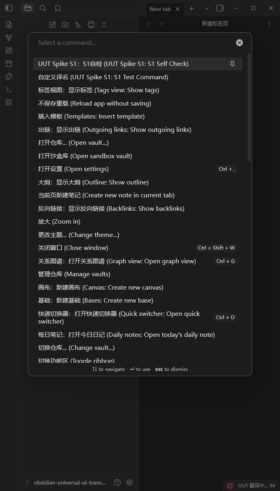
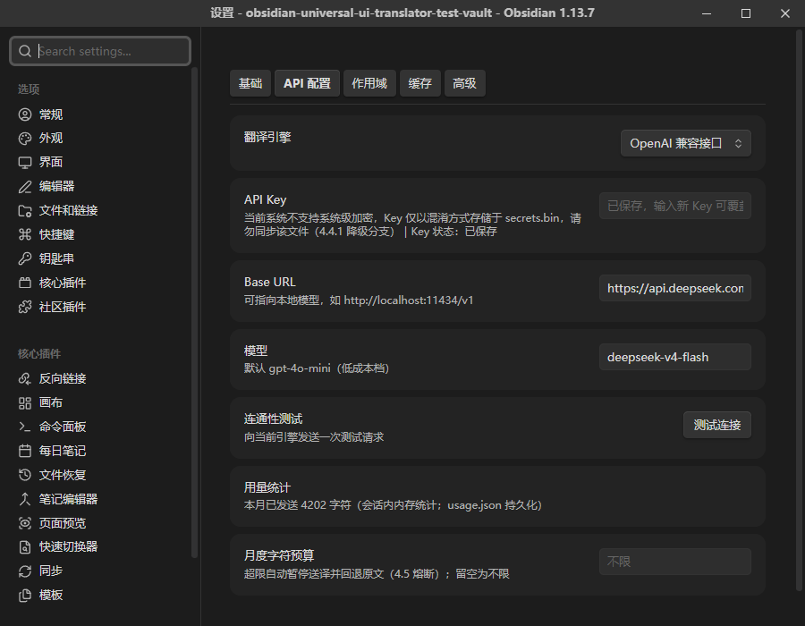

# Universal UI Translator 新手使用说明

> 这份说明写给**刚开始学用 Obsidian 的朋友**。不讲原理、不堆术语，跟着一步一步做就能用起来。
> 如果你已经玩得很熟，直接看 [README](../README.md) 就够了。

---

## 一、这个插件能帮你做什么？

Obsidian 上很多好用的插件是外国作者写的，界面全是英文。比如装了一个插件后，菜单里写着 `Insert template`、设置里写着 `Daily notes: Open today's daily note`，看着费劲。

**这个插件的作用：把 Obsidian 界面上的英文（菜单、按钮、命令、设置项）自动翻译成中文。**

效果长这样——按 `Ctrl + P` 打开命令面板，每条命令都变成了"中文 (English)"：



记住三句话：

1. **它只翻译"界面"，绝不碰你写的笔记内容。** 你的日记、文档、文件名，一个字都不会动。
2. **它自己不会翻译**，需要连一个"翻译服务"（类似请一位翻译官）。请哪位翻译官，由你决定——可以用免费的在线服务，也可以用自己电脑上的免费本地模型，**一分钱不用花**（下文会教你怎么选）。
3. 翻译过一次的内容会**记在本地缓存里**，下次再打开同样的界面，直接显示缓存结果，不再重复请求、不重复花钱。

> ⚠️ 前提条件：只支持 **电脑端**（Windows / macOS / Linux），手机和平板用不了；Obsidian 版本需要 **1.5.0 或更高**（在 Obsidian 的"设置 → 关于"里可以看到版本号）。

---

## 二、开始前：先搞懂 3 个基本概念

如果你已经是 Obsidian 老手，这一节可以跳过。

**1. 库（Vault）是什么？**
Obsidian 把你的所有笔记存在一个普通文件夹里，这个文件夹就叫"库"。它就在你的电脑上，路径是你自己选的，比如 `D:\我的笔记`。插件、设置也都放在这个文件夹里（具体在库里一个名叫 `.obsidian` 的隐藏文件夹中）。

**2. 社区插件是什么？为什么要"关闭安全模式"？**
Obsidian 自带的功能叫"核心插件"；全世界网友开发的功能叫"社区插件"。Obsidian 默认开启"安全模式（Restricted mode）"，会禁用所有社区插件。要装本插件，需要在 **设置 → 社区插件** 里点一下"关闭安全模式 / Turn on community plugins"。这是 Obsidian 的标准操作，所有社区插件都这么装。

**3. 命令面板是什么？**
按 `Ctrl + P`（Mac 是 `Cmd + P`）弹出的那个搜索框，可以搜索并执行各种命令。本插件安装后会提供一个命令：**「临时显示原文/恢复译文」**，后面会用到。

---

## 三、安装（三种方式，任选其一）

### 方式 A：社区插件市场（最简单，但暂未上架）

插件通过官方审核后：设置 → 社区插件 → 浏览 → 搜索 **Universal UI Translator** → 安装 → 启用。
**目前还在审核流程中，请先用方式 B 或 C。**

### 方式 B：用 BRAT 安装（推荐）

BRAT 是一个"专门装测试版插件的插件"，以后插件更新了它会提醒你，最省心。

1. 打开 Obsidian → 左下角 **⚙ 设置** → **社区插件** → 关闭安全模式；
2. 点 **浏览**，搜索 **BRAT**（全名 "Obsidian 42 - BRAT"），安装并启用它；
3. 按 `Ctrl + P` 打开命令面板，输入 `BRAT`，选择 **"BRAT: Add a beta plugin for testing"**；
4. 在弹出的输入框里粘贴本仓库地址：
   ```
   https://github.com/GarrettFynn/obsidian-universal-ui-translator
   ```
5. 确认后 BRAT 会自动下载安装。最后回到 **设置 → 社区插件**，在"已安装的插件"列表里把 **Universal UI Translator** 的开关打开。

### 方式 C：手动安装（不装 BRAT 就用这个）

1. 在本仓库的 [Releases 页面](https://github.com/GarrettFynn/obsidian-universal-ui-translator/releases)下载最新版本的 3 个文件：`main.js`、`manifest.json`、`styles.css`；
2. 打开你的库文件夹，进入里面的 `.obsidian` 文件夹，再进入 `plugins` 文件夹；
   - `.obsidian` 是**隐藏文件夹**。Windows 资源管理器里点"查看 → 显示 → 隐藏的项目"即可看到；macOS 在 Finder 里按 `Cmd + Shift + .`（句号）切换显示隐藏文件。
   - 如果库里没有 `plugins` 文件夹，说明还没装过社区插件，自己新建一个即可。
3. 在 `plugins` 里**新建一个文件夹**，名字必须叫 `universal-ui-translator`，把刚才下载的 3 个文件放进去。最终结构是：
   ```
   你的库/
   └─ .obsidian/
      └─ plugins/
         └─ universal-ui-translator/
            ├─ main.js
            ├─ manifest.json
            └─ styles.css
   ```
4. 回到 Obsidian → **设置 → 社区插件**，点已安装插件列表右边的 **🔄 刷新** 按钮，找到 **Universal UI Translator**，打开开关。

> ✅ 安装成功的标志：设置窗口左侧列表最下方"社区插件"区域出现 **Universal UI Translator** 一栏。

---

## 四、第一次配置（最关键的一步）

装好后插件不会自动开始翻译，因为你还没告诉它"请哪位翻译官"。跟着做：

1. 打开 **设置 → Universal UI Translator**（在设置窗口左侧最下面），你会看到顶部有五个分页：**基础 / API 配置 / 作用域 / 缓存 / 高级**；
2. 点进 **API 配置** 分页；
3. 在 **翻译引擎** 下拉框里选一个服务（怎么选见下面的"五步选引擎"）；
4. 把申请到的 **API Key**（一串密钥，类似密码）粘贴进 **API Key** 输入框——粘贴后离开输入框会自动保存，下方会显示"Key 状态：已保存"；
5. 点 **测试连接** 按钮。看到成功提示，就说明配置完成，翻译已经自动开始了 🎉



> 💡 你的 Key 会被加密后存在插件目录的 `secrets.bin` 文件里，**不会**写进普通配置文件，也不会被上传到任何地方（除了翻译服务本身）。详见第九节。

### 五步选引擎：我该用哪一个？

| 你的情况 | 推荐选择 | 费用 |
| --- | --- | --- |
| 不想注册任何账号、不想花一分钱、愿意折腾 20 分钟 | **自定义端点（本地模型）**，配合 Ollama | 完全免费 |
| 已经有 OpenAI / DeepSeek / 通义 / Kimi 等任意一家大模型的 API 账号 | **OpenAI 兼容接口** | 极低（界面文字很少） |
| 愿意注册个免费账号，想最省事 | **DeepL**（免费版每月 50 万字符，界面翻译绰绰有余） | 免费档够用 |
| 已有 Google Cloud 或 Azure 账号 | Google Cloud Translation / Azure Translator | 免费档够用 |

> "字符"是什么概念？一条菜单大约 10～30 个字符。DeepL 免费档 50 万字符/月，约等于翻译两万多条界面文本——正常用根本用不完，何况还有本地缓存。

### 各引擎的 Key 怎么拿？

- **OpenAI 兼容接口**：到你的服务商后台创建 API Key（OpenAI 在 platform.openai.com；DeepSeek 在 platform.deepseek.com）。如果用**非 OpenAI 官方**的服务，记得把 **Base URL** 改成服务商给你的地址（例如 DeepSeek 填 `https://api.deepseek.com`），**模型**一栏填服务商的模型名。
- **DeepL**：到 deepl.com 注册开发者账号（选 DeepL API Free），在账号页面复制 Authentication Key 粘贴进来即可。免费版 Key 以 `:fx` 结尾，插件会自动识别，不用管。
- **Google Cloud Translation**：到 console.cloud.google.com 创建项目 → 启用 Cloud Translation API → 创建 API 密钥。
- **Azure Translator**：到 portal.azure.com 创建"Translator"资源，复制密钥和所在区域（如 `eastasia`），区域填进设置页的 **Region** 一栏。
- **自定义端点（本地模型，零成本方案）**：
  1. 到 ollama.com 下载安装 Ollama（一个在自己电脑上跑 AI 模型的免费软件）；
  2. 装好后打开终端（命令行），运行 `ollama pull qwen2.5:3b` 下载一个小巧的翻译够用的模型（约 2GB）；
  3. 保持 Ollama 在后台运行；
  4. 回到插件设置，引擎选 **自定义端点（本地模型）**，端点 URL 填 `http://localhost:11434/v1/chat/completions`，模型名填 `qwen2.5:3b`，**API Key 留空**；
  5. 点测试连接，成功即可。全程不联网、不花钱、不上传任何文字。
  > 本地模型第一次翻译会慢一点（模型要加载），且有缓存后就越用越快。电脑太老或内存小于 8GB 的话，建议改用 DeepL 免费版。

---

## 五、日常使用

配置好之后基本**不用管**，它会在后台默默工作。日常只会用到这几件事：

**切换显示样式**：设置 → Universal UI Translator → **基础** 分页 → 显示模式：

| 模式 | 效果 | 适合谁 |
| --- | --- | --- |
| 纯译文 | 界面只显示中文 | 大多数用户（默认） |
| 双语对照 | `打开今日日记 (Open today's daily note)` | 边用边学英文、怕翻译不准想对照原文 |
| 原文（暂停回写） | 全部恢复英文显示 | 排查问题时用 |

**临时看一眼原文**：按 `Ctrl + P` → 输入「临时显示原文」→ 回车，界面就切回英文；再执行一次这个命令恢复译文。（注意：这个切换对"之后打开"的界面生效，已经显示在屏幕上的文字可能残留旧样式，重新打开那个界面即可。）

**状态栏小字 `UUT 翻译中… 3`**：表示此刻有 3 条文本正在排队翻译，几秒后自动消失。这是正常现象，不用管。

**翻译会越用越快**：第一次打开某个界面要联网翻译（慢一点点），第二次打开直接读本地缓存，秒出。

---

## 六、设置面板逐项说明

### 「基础」分页

| 选项 | 干什么用 | 建议 |
| --- | --- | --- |
| 启用界面翻译 | 总开关 | 保持打开 |
| 显示模式 | 纯译文 / 双语对照 / 原文 | 见上表 |
| 双语格式 | `译文 (原文)` 或 `原文 \| 译文` | 仅双语模式生效，按喜好选 |
| 目标语言 | 翻译成什么语言，默认 `zh-CN`（简体中文）。想翻成繁体填 `zh-Hant`，日语填 `ja` | 一般不用动 |

### 「API 配置」分页

| 选项 | 干什么用 | 建议 |
| --- | --- | --- |
| 翻译引擎 / API Key / Base URL 等 | 见第四节 | — |
| 测试连接 | 发一条测试请求，验证 Key 和地址对不对 | 改了配置就点一下 |
| 用量统计 | 本月已发送多少字符 | 纯展示，不用管 |
| 月度字符预算 | 填一个数字（如 `500000`），用到就自动暂停翻译、界面回退原文，防止意外花钱 | 付费引擎建议设一个；免费/本地引擎留空即可 |

### 「作用域」分页（控制"翻哪里"）

- **翻译 Obsidian 核心界面 / 翻译社区插件界面**：两个大开关，默认全开。
- **拦截器独立开关**（命令面板 / 菜单 / 设置面板 / DOM 兜底）：四个翻译通道各自的开关。平时不用动；**如果发现某个界面被翻译后显示异常，可以只关掉对应那个通道**，其他通道不受影响。
- **插件白名单**：填了之后**只翻译**列表里的插件（每行一个插件 id）。留空表示不限制。
- **插件黑名单**：列表里的插件**不翻译**（默认已包含本插件自己）。如果某个插件被翻译后界面乱了，把它的 id 加进来即可。
- 页面底部有 **已安装插件 id 参考**，照着抄 id 就行，不用记。

### 「缓存」分页

- **缓存统计**：显示缓存条目数和命中率（命中率越高说明越多内容走了本地缓存，越省钱）。
- **清空缓存**：删掉所有已缓存的译文，界面文字会在下次打开时重新翻译。翻译引擎升级、觉得旧译文不满意时用。
- **导出缓存**：把缓存导出为库根目录下的 `universal-ui-translator-cache-export.json`，可以分享给别人。
- **导入缓存**：选择一个别人分享的缓存 JSON 文件，点"导入"，直接白嫖别人翻好的结果，一条 API 都不用调。

### 「高级」分页（不懂就全部保持默认）

| 选项 | 干什么用 |
| --- | --- |
| 跳过规则（正则） | 每行一条"正则表达式"，匹配的文本不翻译。不会写正则就别动 |
| 术语表（固定译法） | 每行一条 `原文=译文`，例如 `Canvas=画布`。命中的词永远按你写的翻，不走 API。**某个词翻得不满意时，加一行就行** |
| 批量聚合窗口 | 攒多少毫秒一起发请求，默认 100。不用动 |
| 最大并发请求数 | 同时发几个请求，默认 3。总被限流就调小到 1～2 |
| 单请求超时 | 默认 30 秒。本地模型太慢可以调大到 60000～120000 |
| 调试模式 | 打开后按 `Ctrl + Shift + I` 在 Console 里能看到翻译日志。排查问题时用 |

---

## 七、它会翻译什么、不会翻译什么

**会翻译**：命令面板、右键菜单、各插件的设置面板、弹窗、提示气泡（Notice）、状态栏文字、各种插件自定义界面。

**不会翻译**（这是刻意的，保护你的内容）：

- ❌ 你写的笔记正文、阅读视图——**你的内容永远不会被翻译、不会被发出**；
- ❌ 文件名、文件夹名、标签页标题、大纲、标签、悬浮预览、搜索摘录；
- ❌ 关系图谱（Graph view）、画布（Canvas）、Excalidraw 画图——技术上属于画布渲染，文字"画"在图里，插件够不着；
- ❌ 本插件自己的设置页（防止"自己翻译自己"套娃）。

---

## 八、常见问题（FAQ）

**Q：装好了、开关也开了，怎么界面还是英文？**
最常见的原因是没配 API Key。打开设置页看 **API 配置** 分页的"Key 状态"是不是"未保存"，填好 Key 后点一次 **测试连接**。另外确认「基础」分页的总开关是打开的。

**Q：启动时提示"已保存的 API Key 在本机解密失败"？**
Key 的加密文件 `secrets.bin` 只能在**生成它的那台电脑**上解开。如果你用 Obsidian Sync、git 或网盘把库同步到了另一台电脑，这个文件在新电脑上是打不开的。解决办法很简单：在新电脑的设置页**重新输入一次 Key** 即可。建议把 `secrets.bin` 加入同步排除列表。

**Q：提示"API Key 可能失效（401/403）"？**
你的 Key 过期了或填错了。去服务商后台检查 Key，把新 Key 粘贴进设置页（会直接覆盖旧的），再点测试连接。

**Q：提示"翻译服务连续失败，已自动暂停 10 分钟"？**
网络不通或服务端故障时，插件会自我保护、暂停请求 10 分钟，避免空烧额度。检查网络（或本地 Ollama 是不是没启动），10 分钟后自动恢复，也可以重启 Obsidian 立即恢复。
**国内网络特别注意**：`api.openai.com`、Google 翻译接口在国内直连不可达，没有代理的话请改用国内可达的端点——OpenAI 兼容接口填 DeepSeek（Base URL `https://api.deepseek.com`）、DeepL 或 Azure，或者用 Ollama 本地模型（完全不联网）。

**Q：用 DeepSeek 时全部超时失败 / tokens 消耗异常大？**
DeepSeek V4 系列模型（如 `deepseek-v4-flash`）**默认开启"思考模式"**：每条界面短文本都会先产生上千 tokens 的推理过程——既慢（超过默认 30 秒超时）又贵（推理 tokens 也计费）。两个解决办法任选：① 设置 → API 配置 → 打开「**关闭思考模式**」开关（1.0.3 起）；② 或把模型改成非推理端点 `deepseek-chat`。同时建议把「高级 → 单请求超时」调到 `120000` 兜底。

**Q：我想完全免费，怎么配？**
用「自定义端点 + Ollama 本地模型」方案（见第四节），或者用 DeepL / Google / Azure 的免费额度。三种免费档每月 50 万～200 万字符，翻译界面文字用不完。

**Q：某个词翻译得不对，能改吗？**
能。设置 → 高级 → **术语表**，加一行 `原文=你想要的译文`，比如 `Daily notes=日记`。以后这个词永远按你的译法显示，而且不再消耗 API。

**Q：某个插件被翻译后界面错乱/功能异常，怎么办？**
两个办法，任选其一：① 设置 → 作用域 → **插件黑名单**里加上那个插件的 id；② 如果只影响某一类界面，关掉对应的**拦截器开关**（比如只关"菜单"）。改完即时生效，不用重启。

**Q：翻译得慢 / 状态栏一直显示"翻译中"？**
第一次翻译新界面时要联网，属正常；有缓存之后就快了。用本地模型的可以把「高级 → 单请求超时」调大。网络差的可以确认下并发数不要调太高。

**Q：插件升级后，原来的缓存还能用吗？**
插件会在缓存里记录"这条译文来自哪个插件的哪个版本"，**对方插件升级后旧译文自动作废、重新翻译**，不会出现"界面变了译文还是旧的"的问题。无需手动清缓存。

**Q：缓存占地方吗？能删吗？**
上限 5000 条，通常只有几百 KB，存在插件目录的 `translation-cache.json`。随时可以在「缓存」分页一键清空，没有任何副作用（只是下次重新翻译一遍而已）。

**Q：怎么彻底关掉 / 卸载？**
临时关闭：设置 → 社区插件 → 关掉 Universal UI Translator 的开关，界面立即恢复原文。彻底卸载：同一页面点垃圾桶图标即可。插件卸载时会把所有界面改动**完整还原**，不会留下任何痕迹。

---

## 九、隐私与安全（大白话版）

- **你的笔记内容不会被翻译**，自然也不会被发给任何服务器；
- 被发出去的只有**界面文字**（比如菜单上的 "Save"），而且只发给你自己配置的那一个翻译服务，插件没有任何遥测、统计、上报行为；
- API Key 用操作系统自带的加密机制（Electron safeStorage）加密后存在本地 `secrets.bin`，**密文只能在你这台电脑上解开**；
- 用 Ollama 本地模型方案的话，**所有数据都不离开你的电脑**。

---

## 十、更新与获取帮助

- **BRAT 安装的**：BRAT 会提示更新，或在命令面板执行 `BRAT: Check for updates...`；
- **手动安装的**：到 Releases 页面下载新版的 3 个文件，覆盖插件目录里的旧文件，重启 Obsidian；
- 遇到问题先看第八节 FAQ；也可以在仓库的 Issues 页面提问。

祝使用愉快！🎉
